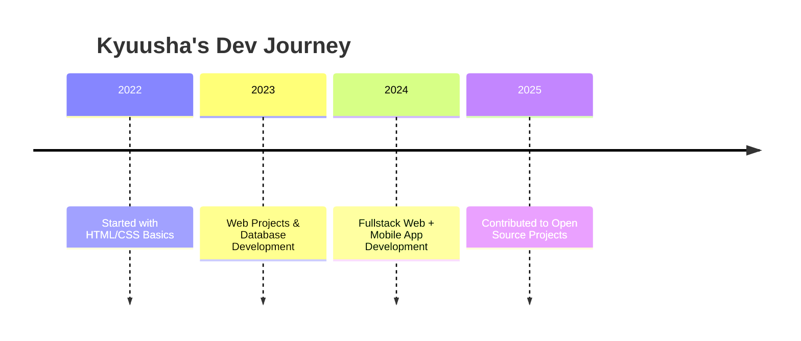

# 💻 Kyuusha - Informatics Engineering Student & Tech Enthusiast 

## 🔎 About Me [🔗](https://itskyuusha.github.io)

I'm an informatics engineering student with a creative mind and a strong interest in problem-solving through code. I enjoy working on real-world projects involving **web**, **mobile**, and **desktop applications**.

- 💽 **Currently Working On**: Developing innovative software across multiple platforms.
- 🤝 **Looking for Collaborations**: Open to working with passionate devs on UI/UX, databases, or smart apps.
- 🌱 **Learning Focus**: Flutter, Java, scalable backend systems, and AI integration.
- 💬 **Talk to Me About**: Software development, databases, or cool tech tools.
- ⚡ **Fun Fact**: I treat debugging like solving puzzles—fun, frustrating, and satisfying!

---

## 🧠 Side of Me

- 🧑‍💻 Avid programmer & tech explorer.
- 🎨 Creative designer who loves UI details.
- 🧳 Sometimes I dream in code.
- 🎷 Music fuels my productivity.
- 💡 Problem solver at heart, always looking for better solutions.
- 📚 Lifelong learner, constantly upgrading my skills.
- 🚀 Passionate about building future tech and innovative apps.
- 🌍 Travel enthusiast who loves exploring new cultures and ideas.
- 🕹️ Gamer by night, coder by day.

---

| **✨ Focus**      | **🎮 Hobbies**            | **💬 Motto**            | **🏆 Best dev companion** |
| ---------------- | ------------------------- | ----------------------- | ------------------------- |
| 100% when coding | Gaming, Coding, Traveling | "Code. Fail. Fix. Win." | Coffee & Music            |

---

## 🌐 Socials:

          
---

## 💻 Tech Stack:

                                                      
---

## 🧭 My Tech Journey

---

## 🛠️ Future Project Wishlist

- 🤖 AI-powered personal assistant to help users with various daily tasks
- 🏠 Smart home automation system based on user habits
- 🌍 Platform for local news, events, and public services information
- 🐞 AI-based bug tracking for applications/websites
- 💻 Tool for facilitating communication and remote team collaboration
- 💳 Digital wallet to manage assets with analysis features
- 🧠 Mental health tracker with sentiment analysis and suggestions
- 🗣️ Real-time voice/text language translator

---

## 🧬 Behind the Code

- Write **clean**, **reusable**, and **well-documented** code
- Constantly learn from mistakes and feedback
- Prioritize **user needs** in every feature built

---

## 📚 Self-Learners Tips

- 🔎 Learn by building, not just reading docs
- ✨ Start small, iterate fast
- 🧠 Understand concepts before frameworks
- ♻️ Practice > Perfection

---

## 🧹 Did You Know?

- Debugging is like solving a puzzle — the thrill is in finding the piece that fits
- Writing clean code is an art form, but messy code can be a masterpiece in progress
- The best way to predict the future of tech? Build it
- The more you code, the more you realize how much you don’t know
- A good developer knows when to ask for help, a great one knows when to Google first
- Code is my superpower, but coffee is my sidekick
- Every bug is just a challenge waiting to be conquered

---

## 💬 Quote

> “Write code like you’re telling a story, and every bug is a plot twist.” – **Kyuusha**

---

## 📸 Custom Banner

---

